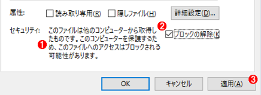
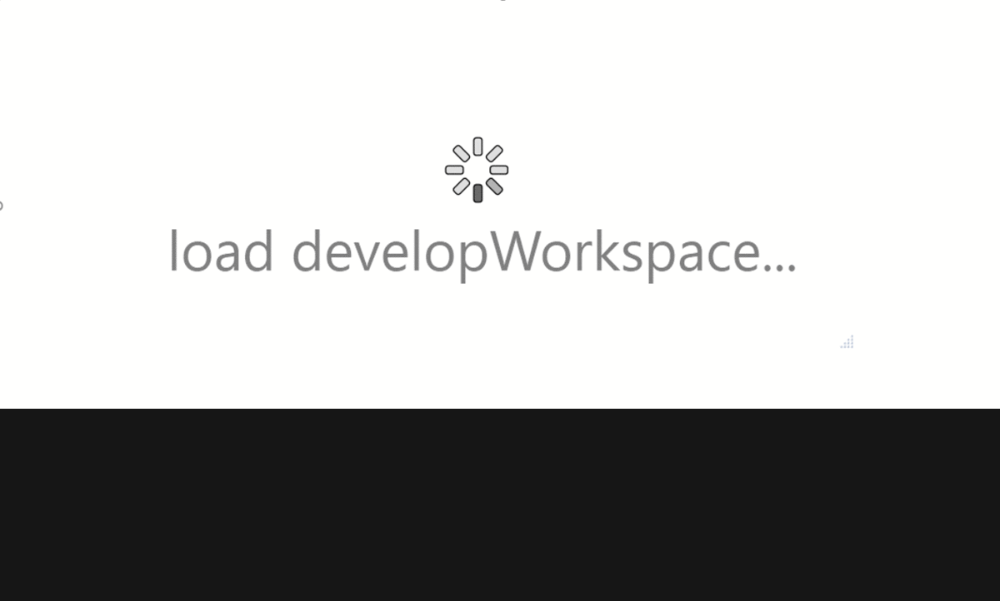

# developer's Workspace1.5

  
DB支援とC#スクリプトをコア機能として内蔵しています。コア機能を足掛けとしてAddInを作成することによって多様なタスクを支援します。 
 
> 詳細の使い方は、
>> * ZipファイルにあるＨｅｌｐファイルを参照していただく 
>> * 画面上の各パーツのTooltipsの説明文をご覧になっていただくことが可能です
>> * このページにある各機能のスクリーンショットをご覧になって、主な使い方を参照してください

>インストールについて、
>> * .Net framework4.6以上がインストールされたWindows7/10のPCに、Zipファイルをダウンロード・解凍を行い、解凍したフォルダーにあるdevelopWorkspace.exeを起動してからのご利用になります。
>> * `windows10が使用される場合、Zipファイルのファイル属性を開いてセキュリティのブロックを解除してから解凍してください！`  

>>> 

  

### DB支援

このツールは、オールインワンのDB管理ツールを代替するものではなく、プログラマーや保守要員といった方々の日常作業には種類雑多なDB製品との関わりをお持ちで、またそれらのDBに特化した多岐に渡るツールを利用されているのが常である。数多い機能のうち、よく利用されている機能は非常に限られています。各種ツールの使い方はまちまちであり、一貫性を欠けることによって作業効率を引き下げられてしまうことがよくあります。

こういった問題を少しでも解消すべく、みなさまが親しんでいるExcelを軸とし、開発、テスト、保守作業で必要なデータをExcelで作成して、DBとシムレスに連携する機能を提供します。
Excelは業務に沿ったデータを考えながら作って、またコメントを付けたり、色分けしたりして優れた柔軟性を持つ、それらの特徴を生かしつつ、DBとシムレスに連携する機能を提供することでプログラマーのみなさんにはもちろんのこと、テスト、保守などの作業に携わる方々にも役立つ場面が多いだろう。

###### 利用シナリオ
* テストデータ作成
* データバックアップ、移行作業

##### 使い方
下記の各機能のスクリーンショットをご覧になって、主な使い方を参照してください。

* データエクスポート

* DB接続情報追加/編集

* 差分作成

### c# スクリプト

c#言語をスクリプトぽく使うための機能であり、日常には機械的で、重複のある作業が多く、それをスクリプト化して、自動的に行うことで、作業効率化UPに繋がります。

###### 利用シナリオ
*  json/xml/csvなど多岐のデータソースからコード生成（code generator）
*  ＲＤＢ以外のデータ作成（dbsupportのＵＩと同等に直感的にデータのエクスポート/インポート）

